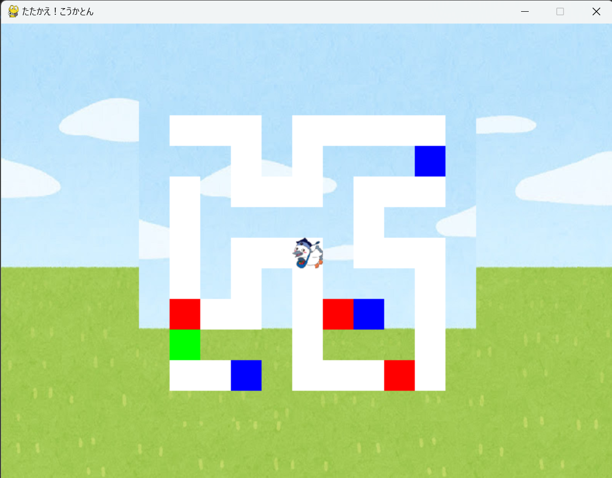

# ローグライクこうかとん
# ローグライクこうかとん

## 実行環境の必要条件
* python >= 3.10
* pygame >= 2.1

## ゲームの概要
* 11×11の迷路が自動生成される。
* プレイヤーと敵が交互に行動するターン制バトル。
* プレイヤーは通常攻撃やスキルを選択可能。
* ボス戦では強力なボスが登場。
* 戦闘マス: 敵との戦闘が発生。
* 強化マス: スキルの追加またはステータスの上昇を選択可能。
* 回復マス: プレイヤーのHPを全回復。
* 戦闘に勝利するごとに、プレイヤーのステータスがランダムに上昇。
